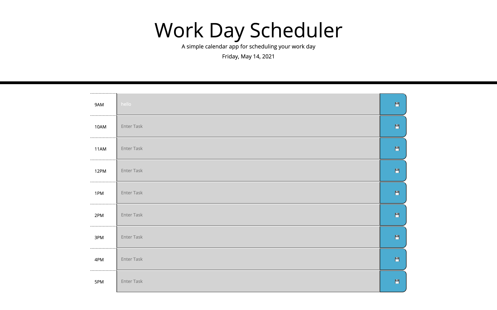

# Day_Planner
This app is a work day planner that can be used to schedule one's day.  Upcoming hours are displayed in green, the current hour red, and the past hours are grey.  Once the user enters in a task and clicks the save button, that item is stored and will be displayed upon refresh.  If an item is entered but not saved, the item is not displayed.

# URL of deployed application
https://hope1407.github.io/Day_Planner/

# Screenshot of application

